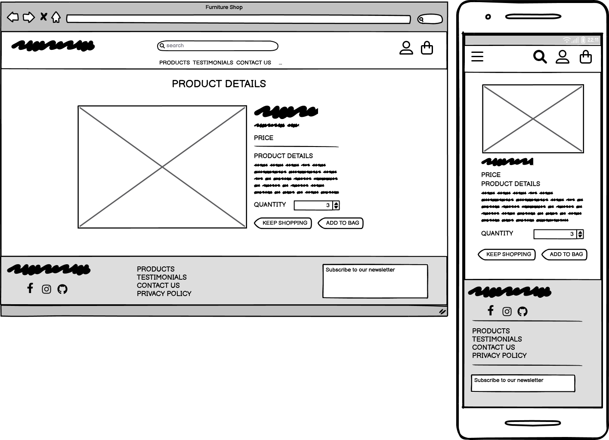
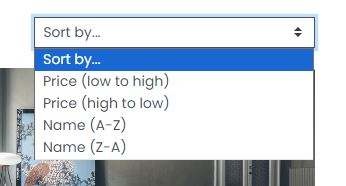
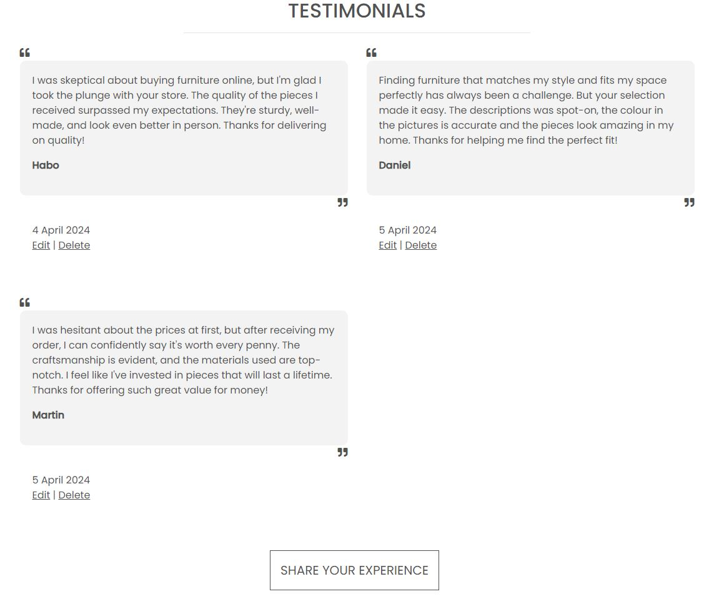
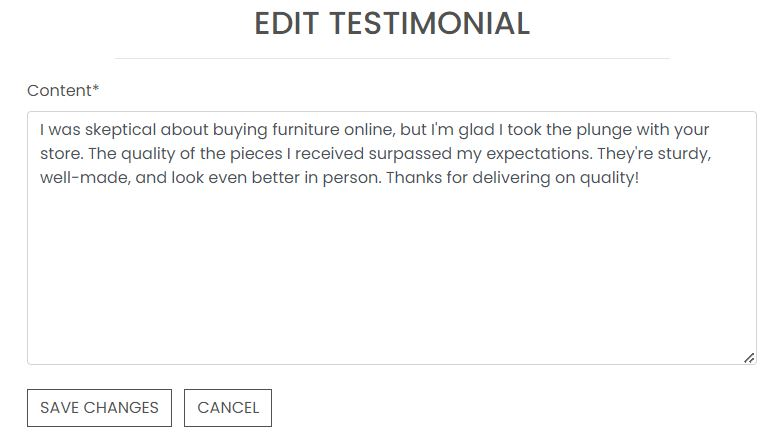
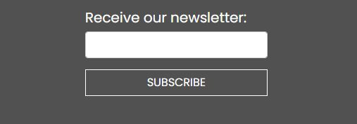
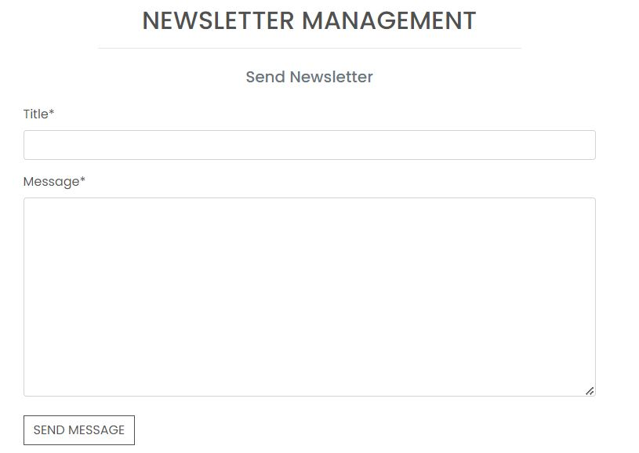

# Lari Living - eCommerce Website

You can access the website live link here: **[Lari Living](https://pp5-lari-living-2c9565c3cb2d.herokuapp.com/)**

Lari Living operates as a B2C e-commerce store focused on home décor. The platform targets users interested in upscale interior products. Additionally, users can view images and testimonials or leave their own feedback.
Payment transactions are facilitated through Stripe. Please be aware that this website is for educational purposes only, and users should refrain from entering personal credit/debit card details. Test card details are available for testing purposes: [Stripe](#payments-with-stripe)


## Contents

## Table of Contents

- [User Experience (UX)](#user-experience-ux)
- [Design](#design)
- [Agile Methodology](#agile-methodology)
- [Database Diagram](#database-diagram)
- [Defensive Design](#defensive-design)
- [Features](#features)
- [Payments with Stripe](#payments-with-stripe)
- [Business Model](#business-model)
- [Testing](#testing)
- [Technologies Used](#technologies-used)
- [Deployment](#deployment)
- [Credits](#credits)
- [Acknowledgments](#acknowledgments)

## User Experience (UX)
Typical Lari Living customers are affluent adults who have a taste for stylish furniture and desire to create elegant living spaces.

The UI/UX design prioritizes simplicity and functionality. The layout is divided into three sections on every page: header, footer, and central part.
- In the header and footer, users find essential links like link to the shopping section, contact us, and testimonials, along with access to their profile and shopping bag.
- The central part features clear buttons for shopping and contacting the store. Logos at the corner provide quick access to user profiles and bags.
- The footer includes links to web pages and a newsletter subscription field, stimulating user engagement.
This design ensures an intuitive browsing experience for Lari Living's customers.

### User Stories

#### EPIC | Initial Set Up
- **User Story: Initial Django Setup [#1](https://github.com/Darioc18/PP5_lari_living/issues/1)** - As a developer, I can carry out an initial deployment of the application so that I can ensure its functionality.
- **User Story: Preliminary Deployment [#2](https://github.com/Darioc18/PP5_lari_living/issues/2)** - As a developer, I can carry out an initial deployment of the application so that I can ensure its functionality.

#### EPIC | Registration and User Accounts
- **User Story: Account registration [#3](https://github.com/Darioc18/PP5_lari_living/issues/3)** - As a site user I can easily register for an account so that I can have a personal account and I can view my profile.
- **User Story: Account Login/Logout [#4](https://github.com/Darioc18/PP5_lari_living/issues/4)** - As a site user I can easily login or logout so that I can access my personal account information.
- **User Story: Account Recovery [#5](https://github.com/Darioc18/PP5_lari_living/issues/5)** - As a site user I can easily recover my password in case I forget it so that I can recover access to my account.
- **User Story: Email Confirmation Upon Registration [#6](https://github.com/Darioc18/PP5_lari_living/issues/6)** - As a site user I can receive an email confirmation after registering so that I can verify that my account registration was successful.
- **User Story: User Profile [#7](https://github.com/Darioc18/PP5_lari_living/issues/7)** - As a site user I can have a personalized user profile so that I can view my personal order history and order confirmations, and save my payments information.

#### EPIC | Admin & Store Management
- **User Story: Admin Products CRUD [#8](https://github.com/Darioc18/PP5_lari_living/issues/8)** - As a store owner I can add/edit/delete products through an easy-to-use interface so that I can manage the store's contents.

#### EPIC | Sorting and Searching
- **User Story: Sort list of products [#11](https://github.com/Darioc18/PP5_lari_living/issues/11)** - As a shopper I can sort the list of available products so that I can identify the best priced and categorically sorted products.
- **User Story: Sort a specific category of products [#12](https://github.com/Darioc18/PP5_lari_living/issues/12)** - As a shopper I can sort a specific category of products so that I can find the best price products in a specific category, or sort the products in that category by name.
- **User Story: Search product [#13](https://github.com/Darioc18/PP5_lari_living/issues/13)** - As a shopper I can search for a product by name or description so that I can find a specific product I'd like to purchase.
- **User Story: Search result visibility [#14](https://github.com/Darioc18/PP5_lari_living/issues/14)** - As a shopper I can easily see what I've searched for and the number of results so that I can quickly decide whether the product I want is available.

#### EPIC | Newsletter
- **User Story: Store owner: send newsletter [#15](https://github.com/Darioc18/PP5_lari_living/issues/15)** - As a store owner I can send out a newsletter via email so that I keep customers updated with news and events about my store.
- **User Story: Store owner: unsubscribe from newsletter [#16](https://github.com/Darioc18/PP5_lari_living/issues/16)** - As a store owner I can unsubscribe subscribers from newsletter.
- **User Story: Site user: newsletter subscription [#17](https://github.com/Darioc18/PP5_lari_living/issues/17)** - As a site user I can sign up for the website's newsletter so that I can keep up to date with new products, promotions, and events.
- **User Story: Site user: unsubscribe from newsletter [#18](https://github.com/Darioc18/PP5_lari_living/issues/18)** - As a site user I can unsubscribe from newsletter so that I don't receive store newsletters anymore.

#### EPIC - Testimonials
- **User Story: Site user access to testimonials [#20](https://github.com/Darioc18/PP5_lari_living/issues/20)** - As a site user, I can read testimonials from other users so that I can gain insight into the experiences of previous customers and make informed decisions.
- **User Story: Site user testimonial submission [#21](https://github.com/Darioc18/PP5_lari_living/issues/21)** - As a satisfied customer I can share my positive experience through a testimonial so that others can benefit from my feedback and feel confident in choosing products.
- **User Story: Site user updating testimonials [#22](https://github.com/Darioc18/PP5_lari_living/issues/22)** - As a returning customer I can submit an updated testimonial so that I can express ongoing satisfaction and contribute to maintaining the credibility of the testimonial page.
- **User Story: Site owner oversight of testimonials [#23](https://github.com/Darioc18/PP5_lari_living/issues/23)** - As a site owner, I can review and delete testimonials so that I can verify the authenticity and relevance of the content displayed on the testimonial page.
- **User Story: Site owner approval of testimonials [#24](https://github.com/Darioc18/PP5_lari_living/issues/24)** - As a site owner I can review and approve testimonials before they are published so that I can check the authenticity and relevance of the content displayed on the testimonial page.

#### EPIC | Contact
- **User Story: Contact Form Accessibility [#25](https://github.com/Darioc18/PP5_lari_living/issues/25)** - As a site user I can easily find the contact form so that I can reach out to the company with any inquiries or issues.
- **User Story: Intuitive contact form interface [#26](https://github.com/Darioc18/PP5_lari_living/issues/26)** - As a site user I can use a simple and intuitive contact form with clear instructions so that I can quickly send my message without confusion.
- **User Story: Submission confirmation notification [#27](https://github.com/Darioc18/PP5_lari_living/issues/27)** - As a site user I can receive a confirmation message after submitting the contact form so that I know my message has been successfully sent.
- **User Story: Error prevention and validation [#28](https://github.com/Darioc18/PP5_lari_living/issues/28)** - As a site user I want the contact form to have built-in validation to prevent errors, such as submitting the form without filling in required fields or entering an invalid email address.
- **User Story: Comprehensive contact information fields [#29](https://github.com/Darioc18/PP5_lari_living/issues/29)** - As a site user I can fill in fields for important information such as my name, email address, and the nature of my inquiry so that the company can respond effectively.

#### EPIC | Purchasing and Checkout
- **User Story: Product quantity selection at checkout [#31](https://github.com/Darioc18/PP5_lari_living/issues/31)** - As a shopper I can select and see the quantity of a product when purchasing it so that I don't accidentally select the wrong product quantity.
- **User Story: View items in bag before purchase [#32](https://github.com/Darioc18/PP5_lari_living/issues/32)** - As a shopper I can view items in my bag to be purchased so that I can identify the total cost of my purchase and all items I will receive.
- **User Story: Adjust quantity of items in bag [#33](https://github.com/Darioc18/PP5_lari_living/issues/33)** - As a shopper I can adjust the quantity of individual items in my bag so that I can easily make changes to my purchase before checkout.
- **User Story: Easy payment information entry [#34](https://github.com/Darioc18/PP5_lari_living/issues/34)** - As a shopper I can easily enter my payment information so that I can checkout quickly and with no hassles.
- **User Story: View order confirmation post checkout [#36](https://github.com/Darioc18/PP5_lari_living/issues/36)** - As a shopper I can view an order confirmation after checkout so that I can verify that I haven't made any mistakes.
- **User Story: Receive email confirmation post checkout [#37](https://github.com/Darioc18/PP5_lari_living/issues/37)** - As a shopper I can receive an email confirmation after checking out so that I can keep the confirmation of what I have purchased for my records.

[Back to Contents](#table-of-contents)

## Design
In the CSS file, variables are used to keep color definitions consistent across the entire stylesheet. This approach simplifies color updates throughout the website by adjusting the color once in the variable, maintaining design uniformity.

Attention is also given to ensuring a clear contrast between background colors and text at all times, improving user accessibility.
### Colour Scheme
The design is clean and utilizes three neutral colors strategically to draw attention to the color and forms of the products.
Colour palette from [Coolors](https://coolors.co/)


 ### Imagery
 A minimalist hero image was chosen to convey a sense of elegance and luxury, without overwhelming the viewer. The simplicity of the design allows the focus to remain on the features of the website enhancing the general visual appeal.

### Logo

The logo is designed with sinuous lines that evoke the image of a figure reclining comfortably. Placing the name of the brand atop the design, adds to its sophistication while ensuring clarity and brand recognition. This logo design captures the essence of Lari Living's ethos, subtly communicating luxury and comfort.


### Favicon

A favicon was designed to appear in the browser tab. It incorporates the logo within a circular shape with inverted colors, and the initials of the store's name are positioned on top.


### Typography
The chosen font, used throughout the website, brings a modern and vibrant feel to the brand's image, without being too rigid and adding to its contemporary appeal: [Poppins](https://fonts.google.com/specimen/Poppins) Google font.


### Wireframes

Wireframes were created using [Balsamiq](https://balsamiq.com/).

<details>
 <summary>Home Page</summary>


</details>

<details>
 <summary>Products</summary>


</details>

<details>
 <summary>Product Details</summary>


</details>

<details>
 <summary>Bag</summary>


</details>

<details>
 <summary>Checkout</summary>


</details>

<details>
 <summary>Profile</summary>


</details>

<details>
 <summary>Testimonials</summary>


</details>

<details>
 <summary>Contact</summary>


</details>

[Back to Contents](#table-of-contents)

## Agile Methodology

Agile methodology is an iterative and flexible approach to project management and software development that prioritizes adaptability, collaboration, and customer satisfaction. It emphasizes incremental progress, continuous feedback, and the ability to respond to changing requirements throughout the development process.

Principles of agile methodology have been used during the website development, incorporating the following key aspects:

### GitHub Projects/Kanban Board

GitHub Projects was used to manage the development process following an agile methodology. The project board, accessible through this [link](https://github.com/users/Darioc18/projects/4/views/1?layout=board), served as a practical tool for organizing tasks and tracking progress.

The Epics were documented within the GitHub project as Milestones. A Github Issue template was create to facilitate adding User Stories to the kanban board. For each User Story, a GitHub Issue was created and allocated to a milestone (Epic).

### MoSCoW Prioritization

The MOSCOW method was employed for task prioritization, categorizing them into Must-haves, Should-haves, Could-haves, and Won't-haves. This systematic prioritization ensured a focused and flexible development process.

<details>
<summary>MoSCoW & GitHub Kanban</summary>


</details>

[Back to Contents](#table-of-contents)

## Database Diagram

The data model for Lari Living follows Object-Oriented Programming principles. SQLite was used as database during development, while Postgres was chosen for the Heroku-deployed version.

### ERD

An entity relationship diagram (ERD) was created using Lucidchart to visualize the relationships between different entities within the database:


[Back to Contents](#table-of-contents)

## Defensive Design

### Form Validation:

Comprehensive form validation mechanisms have been implemented. In the event of incorrect or empty data during form submission, the form blocks the submission and displays a user-friendly warning. This approach ensures users promptly receive feedback about the specific fields causing errors.

### User Authentication

In instances where Django's Class-based-views are utilized, the LoginRequiredMixin is implemented to make sure that requests to access secure pages by non-authenticated users are redirected to the login page.

For function-based views, Django's *login_required* decorator is utilized to restrict access as necessary. These decorators ensure that only authenticated users are able to access certain functionalities, and that access is further limited based on specific conditions or permissions.

To restrict access to non-authorized users, the following code snippet is used in certain instances:
```
if not request.user.is_superuser:
        messages.error(request, 'Sorry, only store owners can do that.')
        return redirect(reverse('home'))
```
### Custom Error Page

Custom error page 404 and 500 were created to give the user more information on the error and to provide them with buttons to guide them back to the site.

<details>
<summary>Error 404 page</summary>


</details>

<details>
<summary>Error 500 page</summary>


</details>

### Database Protection:

Prioritizing confidentiality and safeguarding against unauthorized access, my database security approach involves storing the database URL and secret key in a separate *env-py* file. This precautionary measure was established before the initial push to GitHub, preserving the confidentiality of sensitive information.

### Cross-Site Request Forgery (CSRF) Protection:

The website employs CSRF tokens on all forms across the site, adding an extra layer of defense against cross-site request forgery attacks.

[Back to Contents](#table-of-contents)

## Features

The header and footer sections are consistently displayed across all pages of the website for seamless navigation and continuity in design.

Icons and links directing to other pages within or outside the website are easily identifiable as they change colors when hovered over, providing visual feedback to users. This design choice makes navigation intuitive for the user.

<details>
<summary>Hover Over Icons and Links</summary>


</details>

Toast messages are systematically displayed whenever a user initiates an action on the website, ensuring that users are promptly notified that their action has been received and processed.

<details>
<summary>Toast Message Example</summary>


</details>

### Header

#### Header on Large Screens


The header for large screens is featuring the logo clickable to always return to the home page, a search bar, a navigation bar with the links to the main pages of the website (Products, Testimonials, Contact Us) and two icons to the right to access the profile info and the bag.

#### Header on Mobiles


In the mobile header the navigation bar is contained within a hamburger menu and the search bar is reduced to an icon as the profile and bag icons, optimizing space and maintaining a clean layout. These design choices adhere to the principles of responsive design, for optimal user experience across various devices.


#### User Icon

The User icon navigation link functions as a dropdown menu, incorporating Sign up and Log in links. Upon signing in, the user's username is displayed next to the user icon. The Sign up or Log in options transition to a Log out option once the user has logged in. Furthermore, upon signing in, the 'My Profile' option becomes accessible within the User dropdown menu, providing users with convenient access to their profile information.

<details>
<summary>User Login</summary>


</details>

<details>
<summary>User Menu</summary>


</details>

If the superuser has signed in, additional options are available: *Product Management* and *Newsletter*

<details>
<summary>Superuser Menu</summary>


</details>

#### Bag Icon

When a product is added to the bag, a numerical indicator displaying the total quantity of items appears, positioned at the top right of the bag icon. As users add products to their bag, a toast message emerges in the top right-hand corner of the screen, notifying users that the item has been added. This toast message provides users with a brief overview of the bag contents and the total cost of the bag.
Clicking the bag icon redirects the user to the shopping bag page, where a summary of the items added to the bag is displayed.

<details>
<summary>Bag Toast Message</summary>


</details>

### Footer

#### Footer on Large Screens


The footer is consistently displayed at the bottom of every page, featuring essential elements for user engagement and navigation.
Included in the footer section are links to social media platforms such as Facebook, Instagram, and the GitHub repository.
A custom newsletter sign-up section allows users to input their email address to subscribe to the monthly newsletter.
The links section provides convenient access to key parts of the site, including *Products*, *Testimonials*, *Contact Us*, and *Privacy Policy*.
Clicking on all external links opens the respective website in another tab, preventing users from being redirected away from the site.

#### Footer on Mobile Screens

On mobile devices, the footer is structured in a single column format, containing the same elements as on desktop. The logo of the website is included to provide users with a quick way to return to the homepage from any page they're on. This choice improve ease of navigation across different screen sizes.


### Home Page

The home page features a prominent call-to-action section designed to encourage user engagement. Users are invited to either *Shop Now* or *Contact* the store. This section aims to capture the attention of visitors and prompt them to take action.


### User Account Pages

Django Allauth was implemented to facilitate the Sign up, Log in, and Log out functionalities on the website. Success messages are displayed to inform users about their successful login or logout actions.

During the Sign up process, users are required to verify their email address by clicking on the authentication link sent to the provided email address.

In case a user forgets their password, they can use a password reset functionality by clicking on the *Forgot Password?* option on the login page. This functionality enables users to regain access to their accounts securely.

All the allauth default templates have been styled to match the general design of the website by using both Bootstrap and CSS.

<details>
<summary>Sign Up</summary>


</details>

<details>
<summary>Sign In</summary>


</details>

<details>
<summary>Log Out</summary>


</details>

<details>
<summary>Password Reset</summary>


</details>

### Profile


The delivery details section serves as a section for storing the user's delivery address and phone number. This information is utilized to autofill the delivery address field during the order placement process, streamlining the checkout experience for users.

Under *My Profile* page, the order history section is included. It presents users with a list of every order they have placed on the website. Within this section, a table is displayed showcasing key details including the order number, date of purchase, and the total amount spent. Users can conveniently navigate through their order history by clicking on the order number, which redirects them to a summary page providing detailed information about the selected order. This functionality allows users to easily track and review their past purchases.

Upon clicking on a past order, the order details are listed, and a toast message notifies the user that the order is from a previous transaction. This feature ensures clarity for users, informing them about the status of their order and helping them navigate through their purchase history.


### Products


When users navigate to the *Products* section in the navbar, they find a dropdown menu presenting various categories such as *Sofas*, *Tables*, and *Chairs*. This menu serves as a convenient navigation tool, allowing users to explore specific product categories.

Under each product image, users can find the name of the product, its price, and a link to the category it belongs to. For superusers, Edit and Delete functionalities are available, allowing convenient management of product listings.

<details>
<summary>Products Menu</summary>


</details>

<details>
<summary>Sort Box</summary>


</details>

### Product Detail


When the user clicks on an individual product card, they are directed to the full product details page.

The product detail page showcases the product image, title, price, and product details. If the user is a superuser, edit and delete buttons appear below these details, providing convenient management options.

Situated underneath the product details, the quantity buttons are used to add items to the bag. The plus and minus buttons increase and decrease the input value, respectively. The minus quantity button is disabled when the value is set to 1, and the plus button is disabled when a site user tries to purchase more than 15 units.
If the user manually inputs a negative number or a number exceeding 99 and clicks "Add to Bag", an error message will appear, informing the user of the required parameters for successful submission.

Two buttons at the bottom invite the user to add the item to the bag or to go back to the product section to continue shopping.

### Product Management

#### Add Product


The add product page is accessible by clicking in the user dropdown menu *Product Management*. These option is exclusively visible to superusers.

In case a non-superuser attempts to access the add product page (e.g., by changing the URL), they receive an error message.

To successfully submit the add product form, users must fill out all fields marked with an asterisk. If any required fields are left blank or contain only whitespace upon submission, an error message appears above the respective field, alerting the user to the issue.

Additionally, if a price with more than 6 digits is entered, the form submission fails, and an error message appears under the price field.

Users have the option to upload a photo of the product. If no photo is uploaded, a default image is displayed as the product image.

Upon clicking the 'Add Product' button at the bottom of the form, the product is created, provided there are no errors on the form. Users receive a success message notifying them that the product has been successfully added.

#### Edit Product


Superusers have the option to edit a product by clicking the edit button on the product card or on the product detail page. Upon clicking, the form opens with all fields populated with the original content.

The image field displays a thumbnail of the existing image and includes a checkbox option to remove it. If checked, the image is changed to the default image.

In case a non-superuser attempts to access the edit product page (e.g., by changing the URL), an error message is displayed notifying that only the superuser can access this function.

Upon successful update of the product, the superuser receives a success message notifying them that the product has been successfully updated.

#### Delete Product


Superusers have the option to delete a product by clicking the delete button on the product card or on the product detail page. Upon clicking, the superuser is prompted to confirm if they wish to delete the product or cancel the action.

After confirming the deletion, the superuser receives a success message notifying them that the product has been successfully deleted. This confirmation message provides reassurance and confirmation of the action taken.

### Bag


When the user clicks on the shopping bag icon in the navbar, they are directed to the shopping bag page, where they can view the products they have added to their cart. The page displays each product's name, unit price, quantity, and subtotal.

The quantity input box indicates the quantity of the product added to the bag. Plus and minus buttons allow users to increase and decrease the input value, respectively.

Clicking the *Update* icon button saves any changes to the quantity and updates the item's subtotal. Clicking the *Remove* button removes the item completely from the user's bag. If the user manually inputs a negative number and clicks *Update*, the item is removed from the bag.

At the end of the line items, a summary of the costs is provided. The summary includes the bag's total, delivery cost, and the grand total to pay. Beneath the grand total, users find a message informing them of how much more they need to spend to receive free delivery if they haven't already met the free delivery threshold set to €1500. Two buttons are provided beneath the grand total. From here, users can either continue to the checkout or return to the products page by clicking *Keep Shopping*.

### Checkout


#### Details:

Within the details section, users can fill out their contact details, delivery address, and card number. If the user is a guest, a link to create an account or login will be present. For signed-in users, a checkbox to save the delivery information can be checked. If the user is signed in and has delivery information saved, the details and email address will be automatically filled in. Error messages prompt the user to *Fill in the field* or *match the format requested* if they leave a required field empty, input whitespace in a required field, or include text in the phone number field.

#### Order Summary:

The order summary section provides a detailed overview of all items about to be purchased, including the quantity, subtotal, and grand total. Next to the order summary title is a number reflecting the total number of items in the order. Clicking the product image in the summary takes the user to that product's detail page.

#### Payment:

Card payment is securely handled by Stripe. Incorrect card numbers automatically prompt an invalid card number error. A loading screen appears during payment processing to prevent users from clicking away. A warning message at the bottom of the page informs the user of the amount their card is about to be charged. If the payment form doesn't submit properly or the user closes the browser during the wait animation, the order is still created in the database through the webhook. Once payment is processed, the webhook searches the database to confirm the order exists. If it cannot find it, it creates one using the payment information.

#### Confirmation:

Once the order is processed, the user is redirected to the checkout success page, summarizing the completed order. An email with the order confirmation is sent to the user. At the end of the summary is a *Keep Shopping* button, which takes the user back to the products page.


### Testimonials



A section for users to leave a testimonial has been included.
The page is accessible by clicking the link in the navbar. Upon navigation to the Testimonials page, users can view all testimonials left by previous clients. Each testimonial displays the date, and the user's name.

Users have the capability to edit and delete their own testimonials. To prevent spam on the page, users are restricted to adding only one testimonial.
The superuser possesses the authority to edit or delete testimonials to moderate this section effectively. This setup ensures the integrity and quality of testimonials displayed on the page.

#### Add Testimonial

When a logged-in user clicks on the *Share Your Experience* button on the Testimonials page, they encounter a user-friendly form where they can add a new testimonial to the site. If the user is not logged in, the button is not displayed. This ensures that only logged-in users can access the functionality to add testimonials, maintaining security and preventing unauthorized submissions. The completed testimonial is automatically populated with the user's username and date underneath the body.

<details>
<summary>Add Testimonial</summary>


</details>

#### Edit Testimonial

Users are able to edit their own testimonials by clicking the edit button displayed beside their testimonial on the Testimonials Page. The edit form fields are pre-populated with the existing testimonial text. Upon successful update, the user receives a success message notifying them that the testimonial has been successfully updated.

<details>
<summary>Edit Testimonial</summary>


</details>

#### Delete Testimonial

Users can choose to delete their own testimonial by clicking the delete button displayed beside their testimonial on the Testimonials Page. They are asked to confirm if they wish to delete the testimonial or cancel. Upon deletion, the user receives a success message.

<details>
<summary>Delete Testimonial</summary>


</details>

### Contact Section


From the navbar, users can access the *Contact Us* section, where they have the option to send an email to the pre-set website email address. Within this section, users can select a subject from the dropdown menu and fill in the message field. Given that the website specializes in selling high-end furniture, a high volume of queries from customers is expected. Therefore, having a contact section is essential for the success of the business, as it provides customers with a convenient means of communication.
Upon submitting the form, the user receives a message confirming that the message has been sent successfully.
An email account specific for the store has been created to receive messages. And the functionality has been tested.

<details>
<summary>Email Received</summary>


</details>

### Newsletter

A custom model has been created fot the newsletter.

#### Subscription Form



A subscription form is available for users in the footer, so that at any time during the navigation the user can subscribe. When a user subscribe a success message is displayed to inform the user that he subscribed successfully.

#### Newsletter Management



The superuser can send a newsletter to all subscribed users by accessing it from the profile icon. When on the newsletter page, the superuser can send an email that will be received by everyone in the newsletter. Special attention has been given to ensure that subscribers' details are not displayed in the newsletter emails, maintaining their privacy and confidentiality.
Upon submitting the form, the superuser receives a message confirming that the message has been sent successfully to the mailing list.
An email account specific for the store has been created to send messages. And the functionality has been tested.

<details>
<summary>Newsletter Email Test</summary>


</details>

[Back to Contents](#table-of-contents)

## Payments with Stripe

This website is for educational purposes only, and users should refrain from entering personal credit/debit card details. Use these details for testing purposes:

- Card number: 4242 4242 4242 4242
- MM/YY: 04/24
- CVC: 242

[Back to Contents](#table-of-contents)

## Business Model

Lari Living operates as a Business to Customer (B2C) high-end furniture retailer, dedicated to providing with access to luxurious interior products. With a focus on delivering quality design PRODUCTS, Lari Living offers a curated selection of furniture pieces.Lari Living caterS specifically to those who value elegance and sophistication in their home furnishings.

### Persona Description
Typical Lari Living customers are affluent adults who have a taste for stylish furniture and desire to create elegant living spaces. Whether they are furnishing a new home or updating their current one, they value premium pieces that stand out and reflect their personal style. These customers prioritize quality and are willing to invest in high-end furniture for the aesthetic of their homes.

## Web Marketing

A number of different marketing strategies have been used to promote Lari Living including SEO, social media marketing and email marketing. 

### SEO
Various SEO techniques were implemented to improve the visibility of Lari Living website in search engine results. These tactics aimed to optimize the site's structure, content, and performance to improve its ranking on search engine results pages. Key SEO strategies included:

- **Keywords**
A list of topics and keywords was compiled, covering a range of relevant terms related to high-end furniture and interior design. This list underwent further refinement, focusing on relevance for optimal performance.

- **Brand Trust**
To cultivate brand trust, Lari Living has implemented two strategies:

    - Inclusion of a dedicated **testimonial** page for interior design services on the website. This page showcases feedback from satisfied customers, highlighting their positive experiences and the quality of service provided. To allow easy access, a link to the testimonial page has been incorporated into both the page footer and the main navigation bar, making it accessible to visitors throughout the site.

    - Link to the **privacy policy** featured in the page footer, providing users with clear information on how their data is collected, used, and protected. This reassures users of website commitment to safeguarding their privacy and earning their trust as a reputable brand.

- **Sitemap and robots.txt**
    - To improve the website's visibility and its SEO performance, a sitemap file was created containing a list of page URLs, ensuring that search engines could understand the site's structure and access its content. The sitemap was generated using [XML Sitemaps Generator](https://www.xml-sitemaps.com/), a tool designed to assist in the creation of XML sitemap files, which are easily interpreted by search engine crawlers.

    - A robots.txt file to instruct search engines on which areas of the website they are not allowed to crawl or index. The of the robots.txt file helps to optimize SEO by improving the overall quality and relevance of the site.

### Social Media Marketing 
Facebook has excellent coverage worldwide among people who can purchase products online. A Facebook business page has been set up for Lari Living, focusing on organic social media marketing. The page features a 'Shop Now' button directing users to the website. It serves as a platform for sharing project images and new product arrivals, complementing the main site's content strategy and encouraging user engagement.


### Email Marketing
Lari Living provides visitors with the option to sign up for the newsletter directly from the website, without the need for creating an account. A sign-up box is prominently featured in the site's footer, offering users a convenient way to stay updated on the latest news, new products, services, and special offers from the business. A custom model was created to implement this newsletter subscription service. By leveraging this service, the store effectively communicates with both existing customers and potential prospects, fostering engagement and driving sales through targeted email campaigns.

### Future Development
Here's a breakdown of the planned features and decisions for future development:
- **Payment System:**
Future plans include integrating PayPal payment functionality alongside the existing Stripe payment system to cater to a broader customer base.
- **Suppliers App:**
A future addition to manage suppliers and products, to improve productivity and sales with planned models outlined in the database architecture.
- **Order cancellation**
- **Delivery Cost Calculation:**
Currently, the application follows the model of free delivery over a certain threshold. However, there's an intention to explore various delivery cost calculation methods, considering factors such as shipping company fees, distance, product weight, value, payment method, taxes, and delivery options.

These decisions are made with consideration for feature necessity, development time, and alignment with business operations.

[Back to Contents](#table-of-contents)

## Testing
Testing and results can be found [here](TESTING.md)

[Back to Contents](#table-of-contents)

## Technologies Used

### Languages

- [HTML5]
- [CSS3]
- [JavaScript]
- [Python]

### Databases

- [ElephantSQL](https://www.elephantsql.com/) - Postgres database
- [AWS](https://aws.amazon.com/) - Cloud static/media file storage

### Frameworks

- [Django](https://www.djangoproject.com/) - Python framework
- [Bootstrap 4.6](https://getbootstrap.com/docs/4.6/getting-started/introduction/) - CSS Framework for developing responsiveness and styling.

### Other Programs and Applications

- [VS Code](https://code.visualstudio.com/) - IDE used to create the project.
- [GitHub](https://github.com/) - Used for version control, and agile development.
- [Heroku](https://www.heroku.com/) - Used to deploy the project.
- [Django-allauth](https://pypi.org/project/django-allauth/) - Authentication library to manage the user accounts.
- [PostgreSQL](https://www.postgresql.org/) - Used as the database for this project.
- [Stripe](https://stripe.com/ie) - Used for the payments processing.
- [Crispy Forms](https://django-crispy-forms.readthedocs.io/en/latest/) - Used for Django forms.
- [Chrome Dev Tools](https://developer.chrome.com/docs/devtools/) - Used to troubleshoot and test features, check responsiveness and styling.
- [Google Fonts](https://fonts.google.com/) - Used to import the selected font.
- [Balsamiq](https://balsamiq.com/) - Used to create Wireframes.
- [Photoshop](https://www.adobe.com/products/photoshop.html) - To create the logo, favicon, and edit images.
- [Lucidchart](https://lucid.app/documents#/dashboard) - Used to create the database model design.
- [Coolors](https://coolors.co/) - Used to create and display color palette.
- [ChatGPT](https://chat.openai.com/) - Used for Readme/Testing templates inspiration
- [Font Awesome](https://fontawesome.com/) - Used to import icons.
- [W3C](https://www.w3.org/) - Used for HTML & CSS Validation.
- [Code Institute Python Linter](https://pep8ci.herokuapp.com/) - Used to verify code conformity with PEP8.
- [Jshint](https://jshint.com/) - Used to validate Javascript.
- [Am I Responsive](https://ui.dev/amiresponsive) - Used to display the website image across various devices.
- [Tables Generator](https://www.tablesgenerator.com/markdown_tables) - Used to convert excel testing tables to markdown.
- [Sitemap Generator](www.xml-sitemaps.com) - Used to create sitemap.xml .
- [Privacy Policy Generator](https://www.privacypolicygenerator.info/) - To generate privacy policy.

[Back to Contents](#contents)

## Deployment

Before deploying the application on Heroku, it is essential to update the requirements.txt file. This file contains a list of requirements necessary for the application to function.
To generate the list of requirements, the command ```pip3 freeze > requirements.txt``` is used. Subsequently, the changes are committed and pushed to GitHub.
Before pushing code to GitHub, it is crucial to ensure that all the sensitive credentials are stored in an env.py file, which is included in the .gitignore file. This instructs Git not to track this file, preventing it from being added to GitHub.

### Deployment on Heroku
- Navigate to the [Heroku](https://www.heroku.com/) dashboard, create a new app with a unique name and select a region.
- Install Gunicorn, a production-ready webserver for Heroku. Add gunicorn to the requirements.txt file.
- Navigate to the "Deploy" section in the navigation bar. Under *Deployment Method*, connect to GitHub by selecting the repository name.
- Create a file named Procfile at the root directory of the project (same directory as requirements.txt).
- In the Procfile, declare this is a web process followed by the command to execute your Django project: ```web: gunicorn my_project.wsgi```, where ```my_project``` is the name of the application, in this case *lari_living*.
- Open the my_project/settings.py file and replace DEBUG=True with DEBUG=False.
- In settings.py append the Heroku hostname to the ALLOWED_HOSTS list.
- On Heroku click on the Deploy tab.
- Set up the database on [ElephantSQL](https://www.elephantsql.com)
- Modify settings.py file to retrieve the new sensitive credentials from the environment variables; e.g. ```SECRET_KEY = os.environ.get("SECRET_KEY")```
- Navigate to the settings tab, then scroll down to Config Vars. Any files that should be hidden, such as credentials and API keys, should be included here. Credentials to keep safe for this project are:
1. Django's secret key
2. Database URL
3. AWS access key
3. AWS secret key
4. Email host password
5. Stripe public key
6. stripe secret key
7. Stripe wh secret
- Scroll to the bottom of the deploy page and either click Enable Automatic Deploys for automatic deploys or Deploy Branch to deploy manually. Manually deployed branches will need re-deploying each time the repo is updated.
- Click *View* to view the deployed site.


### Connect the Postgres Database
   - This project uses [ElephantSQL](https://www.elephantsql.com) for the PostgreSQL Database.
   - Sign-up with your GitHub account, then follow these steps:
     - Click *Create New Instance* to start a new database.
     - Provide a name (lari_living).
     - Select the *Tiny Turtle (Free)* plan.
     - You can leave the *Tags* blank.
     - Select the *Region* and *Data Center* closest to you.
     - Once created, click on the new database name, where you can view the database URL and Password.
    - Copy the DATABASE_URL in Config Vars in the Heroku Settings Tab.

### Amazon AWS

This project uses [AWS](https://aws.amazon.com) to store media and static files online.

Once you've created an AWS account and logged-in, make sure you're on the *AWS Management Console* page. These are the steps to follow:
1. **Create a new S3 bucket**
    - Create a new bucket S3, give it a unique name (matching your Heroku app name), and choose the region closest to you.
    - Uncheck *Block all public access*, and set the bucket will be public.
    - From *Object Ownership*, select *ACLs enabled* to allow access to the objects in the bucket, and *Bucket owner preferred* selected.
2.  **Edit bucket settings**
    - Open the bucket page.
    - From the *Properties* tab, turn on static website hosting, and type `index.html` and `error.html` in their respective fields, then click save.
    - Navigate to the *Permissions* tab and scroll down to the *CORS configuration* section and click edit.
    - Paste the following snippet into the text box and click on save changes:

    ```
    [
        {
            "AllowedHeaders": [
                "Authorization"
            ],
            "AllowedMethods": [
                "GET"
            ],
            "AllowedOrigins": [
                "*"
            ],
            "ExposeHeaders": []
        }
    ]
    ```

    - Copy the *ARN* string.
    - Navigate to the *Bucket Policy* section, select the *Policy Generator* link, and use the following settings:
        - Policy Type: *S3 Bucket Policy*
        - Effect: *Allow*
        - Principal: `*`
        - AWS Service: *Amazon S3*
        - Actions: *GetObject*
        - Amazon Resource Name (ARN): *paste-your-ARN-here*
    - Click *Add Statement*
    - Click *Generate Policy*
    - Copy the entire Policy, and paste it into the *Bucket Policy Editor*

    ```
    {
        "Id": "Policy1234567890",
        "Version": "2012-10-17",
        "Statement": [
            {
                "Sid": "Stmt1234567890",
                "Action": [
                    "s3:GetObject"
                ],
                "Effect": "Allow",
                "Resource": "arn:aws:s3:::your-bucket-name/*"
                "Principal": "*",
            }
        ]
    }
    ```

    - Add "/*" to the end of the resource key to allow access to all resources in this bucket.
    - Click *Save*.
    - From the *Access Control List (ACL)* section, click "Edit" and enable *List for *Everyone (public access)*, and accept the warning box.
    - If the edit button is disabled, you need to change the *Object Ownership* section above to *ACLs enabled* (refer to Create Bucket section above).
  
3. **IAM**

    Back on the AWS Services Menu, search for and open *IAM* (Identity and Access Management).

    - On the IAM page from *User Groups*, click *Create New Group*, add a name and click create group.
    - Tags are optional, but you must click it to get to the review policy page.
    - From *User Groups*, select your created group, and go to the *Permissions* tab.
    - Open the *Add Permissions* dropdown, and click *Attach Policies*.
    - Select the policy, then click *Add Permissions*.
    - From the *JSON* tab, select the *Import Managed Policy* link.
    - Search for *S3*, select the `AmazonS3FullAccess` policy, select it and then *Import*.
    - Copy the ARN from the S3 Bucket again, and paste it into "Resources" key on the Policy.

        ```shell
        {
            "Version": "2012-10-17",
            "Statement": [
                {
                    "Effect": "Allow",
                    "Action": "s3:*",
                    "Resource": [
                        "arn:aws:s3:::your-bucket-name",
                        "arn:aws:s3:::your-bucket-name/*"
                    ]
                }
            ]
        }
        ```

    - On the next page add policy name (e.g. `lari-living-policy`) and description and click create policy.
    - From *User Groups* in the left-hand menu, click your user group name created during the above step and select the permissions tab.
    - Click *Attach Policy*.
    - Search for the policy you've just created and select it, then *Attach Policy*.
    - From *User Groups*, click *Add User*.
    - Enter a User name.
    - For "Select AWS Access Type", select *Programmatic Access* and click next.
    - Click on add user to group, select the user group created earlier and click create user.
    - Take note of the Access key ID and Secret access key as these will be needed to connect to the S3 bucket.
    - Click on *Download .csv* to save a copy of the access key on your system (this is the only chance to save them on your system)
    - This contains the user's *Access key ID* and *Secret access key* to include in the Config Vars on Heroku.
    - `AWS_ACCESS_KEY_ID` = **Access key ID**
    - `AWS_SECRET_ACCESS_KEY` = **Secret access key**

4. **Final AWS Setup**

    - If Heroku Config Vars has `DISABLE_COLLECTSTATIC` still, this can be removed now, so that AWS will handle the static files.
    - Inside *S3*, create a new folder called: `media`.
    - Select media images for your project to be uploaded into the media folder.
    - Under *Manage Public Permissions*, select *Grant public read access to this object(s)*.
    - Click *Upload*.

### Stripe API

This project uses [Stripe](https://stripe.com) to process the ecommerce payments.

- Create a Stripe account and log in.
- Navigate to developers section
- From the dashboard, click to expand the *Get your test API keys* and copy the following keys:
  - `STRIPE_PUBLIC_KEY` 
  - `STRIPE_SECRET_KEY`
- As a backup, in case users prematurely close the purchase-order page during payment, we can include Stripe Webhooks.
- From your Stripe dashboard, click *Developers*, and select *Webhooks*.
- Click *Add Endpoint*.
- This section requires a link to the deployed application (Heroku link)
- Click *receive all events*.
- Click *Add Endpoint* to complete the process.
- You'll have a new key here to add to the Config vars on Heroku:
  - `STRIPE_WH_SECRET`

### Gmail API

This project uses [Gmail](https://mail.google.com) to handle sending emails to users for account verification and purchase order confirmations.

- Create a Gmail account and log in.
- Click on the *Account Settings*.
- Click on the *Accounts and Import* tab.
- Within the section called "Change account settings", click on the link for *Other Google Account settings*.
- From this new page, select *Security*.
- Select *2-Step Verification* to turn it on.
- Once verified, select *Turn On* for 2FA.
- Navigate back to the *Security* page, and you'll see a new option called *App passwords*.
- This might prompt you once again to confirm your password and account.
- Select *Mail* for the app type.
- Select *Other (Custom name)* for the device type and input any name.
- A 16-character password (API key) will be generated that will need to be stored as `EMAIL_HOST_PASS` inside Heroku Config vars along with `EMAIL_HOST_USER` that is the Gmail email address

### Local Deployment

This project can be cloned or forked in order to make a local copy on your own system.

- Access the GitHub repository.
- Find the green Code button positioned above the list of files and click it.
- From the dropdown menu, opt for "Download Zip."
- Download and extract the zip file to run it in an editor of your choice.
- Install any applicable packages found within the *requirements.txt* file: `pip3 install -r requirements.txt`.
- Install PostgreSQL on your computer and open ports
- Create an env.py file and input the environment variables
- Start the Django app: `python manage.py runserver`
- Stop the app once it's loaded: `CTRL+C` or `⌘+C` (Mac)
- Make any necessary migrations: `python manage.py makemigrations`
- Migrate the data to the database: `python manage.py migrate`
- Create a superuser: `python manage.py createsuperuser`
- Load fixtures (if applicable): `python3 manage.py loaddata file-name.json` (repeat for each file)
- Everything should be ready now, run the Django app again: `python3 manage.py runserver`

### Local Development

To fork the repository:

1.  Go to the [GitHub repository](https://github.com/Darioc18/PP5_lari_living);
2.  In the top-right corner of the page, click *Fork*;
3.  Optionally type the repository name and description;
4.  Click the green button *Create fork*.

To clone the repository:

1. Go to the [GitHub repository](https://github.com/Darioc18/PP5_lari_living);
2. Above the list of files, click the green button *Code*;
3. Choose your preferred method for cloning: HTTPS, SSH, or Github CLI. Click the copy button to copy the URL to your clipboard.
4. Open Git Bash.
5. Change the current working directory to the location where you want the cloned directory.
6. Type git clone, and then paste the URL you copied earlier.
7. Press Enter. Your local clone will be created.

[Back to Contents](#table-of-contents)

## Credits

### Code

- Boutique Ado CI Walkthrough was used for the base of this project
- [Code Institute Full Template](https://github.com/Code-Institute-Org/ci-full-template)
- [Django Docs](https://docs.djangoproject.com/en/3.2/)
- [Django All Auth Documentation](https://docs.allauth.org/en/latest/installation/quickstart.html)
- [Bootstrap v4.6 Docs](https://getbootstrap.com/docs/4.6/getting-started/introduction/)
- [W3Schools](https://www.w3schools.com/)
- [Stack Overflow](https://stackoverflow.com/)

[Back to Contents](#table-of-contents)

## Acknowledgments

I want to express my gratitude to my fellow peers from the April 2023 cohort at Code Institute and to my Code Institute mentor, [Iuliia Konovalova](https://github.com/IuliiaKonovalova) for her guidance and clear advice to build this project.

[Back to Contents](#table-of-contents)