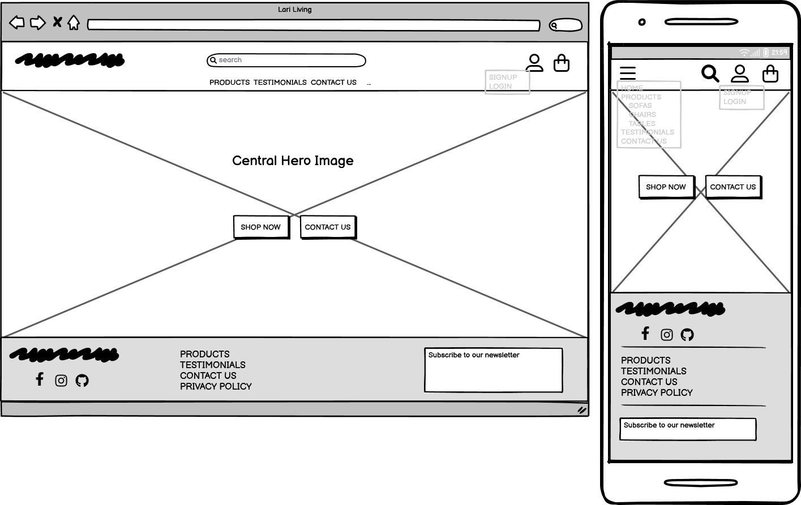

# Lari Living

You can access the website live link here: **[Lari Living](https://pp5-lari-living-2c9565c3cb2d.herokuapp.com/)**

Lari Living operates as a B2C e-commerce store focused on home décor. The platform targets users interested in upscale interior products. Additionally, users can view images and testimonials or leave their own feedback.
Payment transactions are facilitated through Stripe. Please be aware that this website is for educational purposes only, and users should refrain from entering personal credit/debit card details. Test card details are available for testing purposes: [Stripe](#payments-with-stripe)

## Contents

## Table of Contents

- [User Experience (UX)](#user-experience-ux)
- [Design](#design)
- [Agile Methodology](#agile-methodology)
- [Database Diagram](#database-diagram)
- [Defensive Design](#defensive-design)
- [Features](#features)
- [Payments with Stripe](#payments-with-stripe)
- [Business Model](#business-model)
- [Testing](#testing)
- [Technologies Used](#technologies-used)
- [Deployment](#deployment)
- [Credits](#credits)
- [Acknowledgments](#acknowledgments)

## User Experience (UX)
Typical Lari Living customers are affluent adults who have a taste for stylish furniture and desire to create elegant living spaces.

The UI/UX design prioritizes simplicity and functionality. The layout is divided into three sections on every page: header, footer, and central part.
- In the header and footer, users find essential links like link to the shopping section, contact us, and testimonials, along with access to their profile and shopping bag.
- The central part features clear buttons for shopping and contacting the store. Logos at the corner provide quick access to user profiles and bags.
- The footer includes links to web pages and a newsletter subscription field, stimulating user engagement.
This design ensures an intuitive browsing experience for Lari Living's customers.

### User Stories

#### EPIC | Initial Set Up
- **User Story: Initial Django Setup [#1](https://github.com/Darioc18/PP5_lari_living/issues/1)** - As a developer, I can carry out an initial deployment of the application so that I can ensure its functionality.
- **User Story: Preliminary Deployment [#2](https://github.com/Darioc18/PP5_lari_living/issues/2)** - As a developer, I can carry out an initial deployment of the application so that I can ensure its functionality.

#### EPIC | Registration and User Accounts
- **User Story: Account registration [#3](https://github.com/Darioc18/PP5_lari_living/issues/3)** - As a site user I can easily register for an account so that I can have a personal account and I can view my profile.
- **User Story: Account Login/Logout [#4](https://github.com/Darioc18/PP5_lari_living/issues/4)** - As a site user I can easily login or logout so that I can access my personal account information.
- **User Story: Account Recovery [#5](https://github.com/Darioc18/PP5_lari_living/issues/5)** - As a site user I can easily recover my password in case I forget it so that I can recover access to my account.
- **User Story: Email Confirmation Upon Registration [#6](https://github.com/Darioc18/PP5_lari_living/issues/6)** - As a site user I can receive an email confirmation after registering so that I can verify that my account registration was successful.
- **User Story: User Profile [#7](https://github.com/Darioc18/PP5_lari_living/issues/7)** - As a site user I can have a personalized user profile so that I can view my personal order history and order confirmations, and save my payments information.

#### EPIC | Admin & Store Management
- **User Story: Admin Products CRUD [#8](https://github.com/Darioc18/PP5_lari_living/issues/8)** - As a store owner I can add/edit/delete products through an easy-to-use interface so that I can manage the store's contents.

#### EPIC | Sorting and Searching
- **User Story: Sort list of products [#11](https://github.com/Darioc18/PP5_lari_living/issues/11)** - As a shopper I can sort the list of available products so that I can identify the best priced and categorically sorted products.
- **User Story: Sort a specific category of products [#12](https://github.com/Darioc18/PP5_lari_living/issues/12)** - As a shopper I can sort a specific category of products so that I can find the best price products in a specific category, or sort the products in that category by name.
- **User Story: Search product [#13](https://github.com/Darioc18/PP5_lari_living/issues/13)** - As a shopper I can search for a product by name or description so that I can find a specific product I'd like to purchase.
- **User Story: Search result visibility [#14](https://github.com/Darioc18/PP5_lari_living/issues/14)** - As a shopper I can easily see what I've searched for and the number of results so that I can quickly decide whether the product I want is available.

#### EPIC | Newsletter
- **User Story: Store owner: send newsletter [#15](https://github.com/Darioc18/PP5_lari_living/issues/15)** - As a store owner I can send out a newsletter via email so that I keep customers updated with news and events about my store.
- **User Story: Store owner: unsuscribe from newsletter [#16](https://github.com/Darioc18/PP5_lari_living/issues/16)** - As a store owner I can unsubscribe subscribers from newsletter.
- **User Story: Site user: newsletter subscription [#17](https://github.com/Darioc18/PP5_lari_living/issues/17)** - As a site user I can sign up for the website's newsletter so that I can keep up to date with new products, promotions, and events.
- **User Story: Site user: unsubscribe from newsletter [#18](https://github.com/Darioc18/PP5_lari_living/issues/18)** - As a site user I can unsubscribe from newsletter so that I don't receive store newsletters anymore.

#### EPIC - Testimonials
- **User Story: Site user access to testimonials [#20](https://github.com/Darioc18/PP5_lari_living/issues/20)** - As a site user, I can read testimonials from other users so that I can gain insight into the experiences of previous customers and make informed decisions.
- **User Story: Site user testimonial submission [#21](https://github.com/Darioc18/PP5_lari_living/issues/21)** - As a satisfied customer I can share my positive experience through a testimonial so that others can benefit from my feedback and feel confident in choosing products.
- **User Story: Site user updating testimonials [#22](https://github.com/Darioc18/PP5_lari_living/issues/22)** - As a returning customer I can submit an updated testimonial so that I can express ongoing satisfaction and contribute to maintaining the credibility of the testimonial page.
- **User Story: Site owner oversight of testimonials [#23](https://github.com/Darioc18/PP5_lari_living/issues/23)** - As a site owner, I can review and delete testimonials so that I can verify the authenticity and relevance of the content displayed on the testimonial page.
- **User Story: Site owner approval of testimonials [#24](https://github.com/Darioc18/PP5_lari_living/issues/24)** - As a site owner I can review and approve testimonials before they are published so that I can check the authenticity and relevance of the content displayed on the testimonial page.

#### EPIC | Contact
- **User Story: Contact Form Accessibility [#25](https://github.com/Darioc18/PP5_lari_living/issues/25)** - As a site user I can easily find the contact form so that I can reach out to the company with any inquiries or issues.
- **User Story: Intuitive contact form interface [#26](https://github.com/Darioc18/PP5_lari_living/issues/26)** - As a site user I can use a simple and intuitive contact form with clear instructions so that I can quickly send my message without confusion.
- **User Story: Submission confirmation notification [#27](https://github.com/Darioc18/PP5_lari_living/issues/27)** - As a site user I can receive a confirmation message after submitting the contact form so that I know my message has been successfully sent.
- **User Story: Error prevention and validation [#28](https://github.com/Darioc18/PP5_lari_living/issues/28)** - As a site user I want the contact form to have built-in validation to prevent errors, such as submitting the form without filling in required fields or entering an invalid email address.
- **User Story: Comprehensive contact information fields [#29](https://github.com/Darioc18/PP5_lari_living/issues/29)** - As a site user I can fill in fields for important information such as my name, email address, and the nature of my inquiry so that the company can respond effectively.

#### EPIC | Purchasing and Checkout
- **User Story: Product quantity selection at checkout [#31](https://github.com/Darioc18/PP5_lari_living/issues/31)** - As a shopper I can select and see the quantity of a product when purchasing it so that I don't accidentally select the wrong product quantity.
- **User Story: View items in bag before purchase [#32](https://github.com/Darioc18/PP5_lari_living/issues/32)** - As a shopper I can view items in my bag to be purchased so that I can identify the total cost of my purchase and all items I will receive.
- **User Story: Adjust quantity of items in bag [#33](https://github.com/Darioc18/PP5_lari_living/issues/33)** - As a shopper I can adjust the quantity of individual items in my bag so that I can easily make changes to my purchase before checkout.
- **User Story: Easy payment information entry [#34](https://github.com/Darioc18/PP5_lari_living/issues/34)** - As a shopper I can easily enter my payment information so that I can checkout quickly and with no hassles.
- **User Story: View order confirmation post checkout [#36](https://github.com/Darioc18/PP5_lari_living/issues/36)** - As a shopper I can view an order confirmation after checkout so that I can verify that I haven't made any mistakes.
- **User Story: Receive email confirmation post checkout [#37](https://github.com/Darioc18/PP5_lari_living/issues/37)** - As a shopper I can receive an email confirmation after checking out so that I can keep the confirmation of what I have purchased for my records.

## Design
In the CSS file, variables were used to keep color definitions consistent across the entire stylesheet. This approach simplifies color updates throughout the website by adjusting the color once in the variable, maintaining design uniformity.

Attention was also given to ensuring a clear contrast between background colors and text at all times, improving user accessibility.
### Colour Scheme
The design is clean and utilizes three neutral colors strategically to draw attention to the color and forms of the products.
Colour palette from [Coolors](https://coolors.co/)

 ### Imagery
 A minimalist hero image was employed to convey a sense of elegance and luxury, without overwhelming the viewer. The simplicity of the design allows the focus to remain on the features of the website enhancing the general visual appeal.

The logo was designed with sinuous lines that evoke the image of a figure reclining comfortably. Placing the name of the brand atop the design adds to its sophistication while ensuring clarity and brand recognition. This logo design captures the essence of Lari Living's ethos, subtly communicating luxury and comfort.

## Typography
The chosen font, used throughout the website, brings a modern and vibrant feel to the brand's image, without being too rigid and adding to its contemporary appeal: [Poppins](https://fonts.google.com/specimen/Poppins) Google font.

## Wireframes

Wireframes were created using [Balsamiq](https://balsamiq.com/).

 
Home Page

 
Products

 
Product Details

 
Bag

 
Checkout

 
Profile

 
Testimonials

 
Contact

## Payments with Stripe
This website is for educational purposes only, and users should refrain from entering personal credit/debit card details. Use these details for testing purposes:

- Card number: 4242 4242 4242 4242
- MM/YY: 04/24
- CVC: 242

## Business Model

Lari Living operates as a Business to Customer (B2C) high-end furniture retailer, dedicated to providing with access to luxurious interior products. With a focus on delivering quality design PRODUCTS, Lari Living offers a curated selection of furniture pieces.Lari Living caterS specifically to those who value elegance and sophistication in their home furnishings.

### Persona Description
Typical Lari Living customers are affluent adults who have a taste for stylish furniture and desire to create elegant living spaces. Whether they are furnishing a new home or updating their current one, they value premium pieces that stand out and reflect their personal style. These customers prioritize quality and are willing to invest in high-end furniture for the aesthetic of their homes.

## Web Marketing

A number of different marketing strategies have been used to promote Lari Living including SEO, social media marketing and email marketing. 

### SEO
Various SEO techniques were implemented to improve the visibility of Lari Living website in search engine results. These tactics aimed to optimize the site's structure, content, and performance to improve its ranking on search engine results pages. Key SEO strategies included:

- **Keywords**
A list of topics and keywords was compiled, covering a range of relevant terms related to high-end furniture and interior design. This list underwent further refinement, focusing on relevance for optimal performance.

- **Brand Trust**
To cultivate brand trust, Lari Living has implemented two strategies:

    - Inclusion of a dedicated **testimonial** page for interior design services on the website. This page showcases feedback from satisfied customers, highlighting their positive experiences and the quality of service provided. To allow easy access, a link to the testimonial page has been incorporated into both the page footer and the main navigation bar, making it accessible to visitors throughout the site.

    - Link to the **privacy policy** featured in the page footer, providing users with clear information on how their data is collected, used, and protected. This reassures users of website commitment to safeguarding their privacy and earning their trust as a reputable brand.

- **Sitemap and robots.txt**
    - To improve the website's visibility and its SEO performance, a sitemap file was created containing a list of page URLs, ensuring that search engines could understand the site's structure and access its content. The sitemap was generated using [XML Sitemaps Generator](https://www.xml-sitemaps.com/), a tool designed to assist in the creation of XML sitemap files, which are easily interpreted by search engine crawlers.

    - A robots.txt file to instruct search engines on which areas of the website they are not allowed to crawl or index. The of the robots.txt file helps to optimize SEO by improving the overall quality and relevance of the site.

### Social Media Marketing 
Facebook has excellent coverage worldwide among people who can purchase products online. A Facebook business page has been set up for Lari Living, focusing on organic social media marketing. The page features a 'Shop Now' button directing users to the website. It serves as a platform for sharing project images and new product arrivals, complementing the main site's content strategy and encouraging user engagement.

### Email Marketing
Lari Living provides visitors with the option to sign up for the newsletter directly from the website, without the need for creating an account. A sign-up box is prominently featured in the site's footer, offering users a convenient way to stay updated on the latest news, new products, services, and special offers from the business. A custom model was created to implement this newsletter subscription service. By leveraging this service, the store effectively communicates with both existing customers and potential prospects, fostering engagement and driving sales through targeted email campaigns.

### Future Development
Here's a breakdown of the planned features and decisions for future development:
- **Payment System:**
Future plans include integrating PayPal payment functionality alongside the existing Stripe payment system to cater to a broader customer base.
- **Suppliers App:**
A future addition to manage suppliers and products, to improve productivity and sales with planned models outlined in the database architecture.
- **Order cancellation**
- **Delivery Cost Calculation:**
Currently, the application follows the model of free delivery over a certain threshold. However, there's an intention to explore various delivery cost calculation methods, considering factors such as shipping company fees, distance, product weight, value, payment method, taxes, and delivery options.

These decisions are made with consideration for feature necessity, development time, and alignment with business operations.

## Testing
Testing and results can be found [here](TESTING.md)