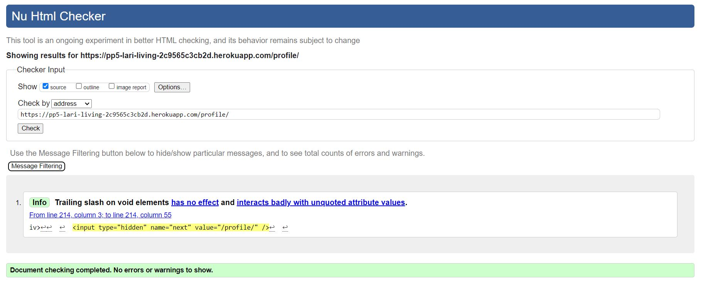
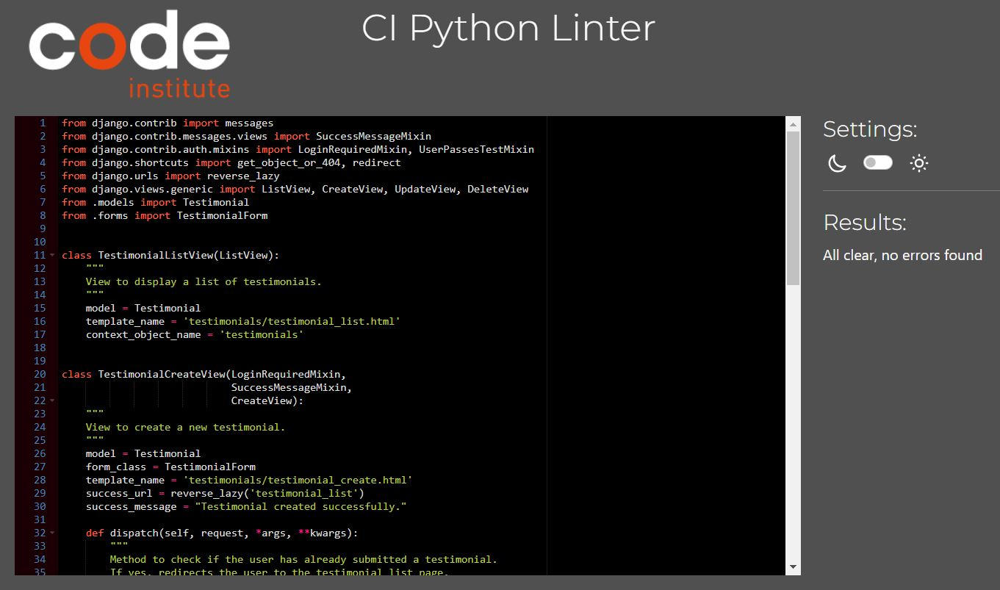

# Lari Living Testing

## Table of Contents

- [User Story Testing](#user-story-testing)
- [Site Administration](#site-administration)
- [Code Validation](#code-validation)
    - [HTML](#html)
    - [CSS](#css)
    - [JavaScript](#javascript)
    - [Python](#python)
    - [Lighthouse](#lighthouse)
- [Browser Testing](#browser-testing)
- [Manual Testing](#manual-testing)
    - [Site Navigation](#site-navigation)
    - [Home Page](#home-page)
    - [All Auth Pages](#all-auth-pages)
    - [Products](#products)
    - [Product Details](#product-details)
    - [Products Management](#products-management)
    - [Bag](#bag)
    - [Checkout](#checkout)
    - [Profile](#profile)
    - [Testimonials](#testimonials)
    - [Contact](#contact)
- [Bugs](#bugs)

## Code Validation

### HTML
All HTML pages were run through the [W3C HTML Validator](https://validator.w3.org/). Results in the table below

| Page                    | Screenshot | Result |
|-------------------------|------------|:------:|
| Home                    ||Pass|
| Products                ||Pass|
| Add Product             ||Pass|
| Edit Product            ||Pass|
| Confirm Delete Product  ||Pass|
| Bag                     ||Pass|
| Checkout                ||Pass|
| Checkout Success        ||Pass|
| Profile                 ||Pass|
| Order History           ||Pass|
| Testimonials            ||Pass|
| Add Testimonial         ||Pass|
| Edit Testimonial        ||Pass|
| Delete Testimonial      ||Pass|
| Contact                 ||Note|
| Sign In                 ||Pass|
| Sign Up                 ||Note|
| Log Out                 ||Pass|
| Password Reset          ||Note|
| 404.html                ||Pass|


Notes: Contact, Sign Up and Password Reset pages are presenting the same error, where Django renders the same id attribute ```id="id_email"``` for both the email input fields used in the newsletter subscription form created for the newsletter subscription in the footer and the email fields present in the other pages where the error is displayed.

Two possible solutions have been considered:
- Update the name of the email field in the newsletter subscribers model
- Use the Django widget to set a custom id attribute for the email that won't clash with the attributes of the other email fields. 

```
class SubscibersForm(forms.ModelForm):
class Meta:
    model = Subscribers
    fields = ['email', ]
    labels = {
        'email': ''
    }
    widgets = {
        'email': forms.TextInput(attrs={'id': 'form-sub'})
    }
```

However, due to time constraints, these solutions were not tested before submission. They will be tested in the future to ensure proper functionality and adherence to best practices.

### CSS

No errors were detected when running the CSS files through the official [W3C CSS Validator](https://jigsaw.w3.org/css-validator/#validate_by_input).

| Page             | Screenshot | Result |
|------------------|:----------:|:-----:|
| *base.css*       ||Pass|
| *checkout.css*   ||Pass|
| *profile.css*    ||Pass|

### JavaScript

No errors were detected when running the JavaScript files through the official [JSHint](https://jshint.com/).

| Page             | Screenshot | Result |
|------------------|:----------:|:-----:|
| *base.html* script       ||Pass|
| *products.html* script   ||Pass|
| *bag.html* script    ||Pass|
| profile: *countryfield.js*    ||Pass|
| checkout: *stripe_elements.js* script    ||Pass|
| *quantity_input_script.html* script    ||Pass|
| *bag.html* script    ||Pass|
| *edit_product.html* script    ||Pass|

### Python

No errors were detected when running the Python files through the [Code Institute Python Linter](https://pep8ci.herokuapp.com/#). Screenshot of the most relevant files are displayed below:

**Bag**

| File                           | Screenshot | Notes     |
|--------------------------------|------------|-----------|
| *contexts.py*                     |   | Pass |
| *views.py*                     |   | Pass |

**Checkout**

| File                           | Screenshot | Notes     |
|--------------------------------|------------|-----------|
| *admin.py*                     |   | Pass |
| *forms.py*                     |   | Pass |
| *models.py*                     |   | Pass |
| *signals.py*                     |   | Pass |
| *views.py*                     |   | Pass |
| *webhook_handler.py*                     |   | Pass |
| *webhooks.py*                     |   | Pass |

**Contact**

| File                           | Screenshot | Notes     |
|--------------------------------|------------|-----------|
| *forms.py*                     |   | Pass |
| *models.py*                     |   | Pass |
| *views.py*                     |   | Pass |

**Lari Living Main**

| File                           | Screenshot | Notes     |
|--------------------------------|------------|-----------|
| *settings.py*                     |   | The three lines in the screenshot cannot be split |
| *urls.py*                     |   | Pass |

**Newsletter**

| File                           | Screenshot | Notes     |
|--------------------------------|------------|-----------|
| *forms.py*                     |   | Pass |
| *models.py*                     |   | Pass |
| *views.py*                     |   | Pass |

**Products**

| File                           | Screenshot | Notes     |
|--------------------------------|------------|-----------|
| *admin.py*                     |   | Pass |
| *forms.py*                     |   | Pass |
| *models.py*                     |   | Pass |
| *views.py*                     |   | Pass |

**Profiles**

| File                           | Screenshot | Notes     |
|--------------------------------|------------|-----------|
| *forms.py*                     |   | Pass |
| *models.py*                     |   | Pass |
| *views.py*                     |   | Pass |

**Testimonials**

| File                           | Screenshot | Notes     |
|--------------------------------|------------|-----------|
| *models.py*                     |   | Pass |
| *urls.py*                     |   | Pass |
| *views.py*                     |   | Pass |

### Lighthouse

Lighthouse validation was used on all pages to assess performance, accessibility, best practices and SEO. Numerous warnings were addressed, notably concerning insufficient contrast ratio between background and foreground colors, resulting in the following scores:

| Page                     | Performance | Accessibility | Best Practices | SEO |
|--------------------------|:-----------:|:-------------:|:--------------:|:---:|
| Home                     |71|95|100|100|
| Products                 |74|91|100|100|
| Add Product              |95|94|100|100|
| Edit Product             |95|94|96|100|
| Confirm Delete Product   |96|95|100|100|
| Bag                      |92|95|100|100|
| Checkout                 |84|82 (note)|100|100|
| Checkout Success         |86|95|100|100|
| Profile                  |91|92|100|100|
| Order History            |84|95|100|100|
| Testimonials             |91|95|100|100|
| Add Testimonial          |90|95|100|100|
| Edit Testimonial         |93|95|100|100|
| Delete Testimonial       |96|95|100|100|
| Contact                  |95|100|100|100|
| Sign In                  |94|96|100|100|
| Sign Up                  |96|95|100|100|
| Log Out                  |96|95|100|100|
| Password Reset           |96|95|100|100|

Notes: The score on the checkout page is influenced by the color of the placeholders in the fields and by the issue of repeating IDs discussed in the [HTML](#html) section. Typically, placeholders have a fainter color, so changing them has not been considered an option. It is foreseen that the score will increase to acceptable levels once the issue mentioned in the HTML section is resolved.

[Back to Contents](#table-of-contents)

## Manual Testing

### Site Navigation

| Element                          | Action                        | Expected Result                                              | Pass/Fail |
|----------------------------------|-------------------------------|--------------------------------------------------------------|-----------|
| NavBar                           |                               |                                                              |           |
| Site Name (logo area)            | Click                         | Redirect to home                                             | Pass      |
| Search Box Function              | Enter Text and Click Search   | Search both the product's title and description for a match. | Pass      |
| My Account Dropdown              | Click                         | Open profile dropdown                                        | Pass      |
| Sign Up Link                     | Click                         | Redirect to Sign Up page                                     | Pass      |
|                                  |                               | (Not visible if user in session)                             | Pass      |
| Login Link                       | Click                         | Redirect to login page                                       | Pass      |
|                                  |                               | (Not visible if user in session)                             | Pass      |
| Product Management Link          | Click                         | Redirect to add_product page                                 | Pass      |
|                                  |                               | (Only visible if superuser in session)                       | Pass      |
| My Profile Link                  | Click                         | Redirect to user profile page                                | Pass      |
|                                  |                               | (Only visible if user in session)                            | Pass      |
| Logout Link                      | Click                         | Redirect to logout confirm page                              | Pass      |
|                                  |                               | (Only visible if user in session)                            | Pass      |
| Bag Link                         | Click                         | Redirect to bag page                                         | Pass      |
|                                  |                               |                                                              |           |
| Mobile Top Header                |                               |                                                              |           |
| Search Icon Button               | Click                         | Open up search box                                           | Pass      |
| Search Box Function              | Enter Text and Click Search   | Search both the product's title and description for a match. | Pass      |
| My Account Dropdown              | Click                         | Open profile dropdown                                        | Pass      |
| Sign Up Link                     | Click                         | Redirect to Sign Up page                                     | Pass      |
|                                  |                               | (Not visible if user in session)                             | Pass      |
| Login Link                       | Click                         | Redirect to login page                                       | Pass      |
|                                  |                               | (Not visible if user in session)                             | Pass      |
| Product Management Link          | Click                         | Redirect to add_product page                                 | Pass      |
|                                  |                               | (Only visible if superuser in session)                       | Pass      |
| My Profile Link                  | Click                         | Redirect to user profile page                                | Pass      |
|                                  |                               | (Only visible if user in session)                            | Pass      |
| Logout Link                      | Click                         | Redirect to logout confirm page                              | Pass      |
|                                  |                               | (Only visible if user in session)                            | Pass      |
| Bag Link                         | Click                         | Redirect to bag page                                         | Pass      |
|                                  |                               |                                                              |           |
| Main Nav                         |                               |                                                              |           |
| Products Dropdown                | Click                         | Open products dropdown                                       | Pass      |
| All Link                         | Click                         | Redirect all products page                                   | Pass      |
| Sofas Link                       | Click                         | Redirect to prints page filtered to sofas                    | Pass      |
| Chairs Link                      | Click                         | Redirect to prints page filtered to chairs                   | Pass      |
| Tables Link                      | Click                         | Redirect to prints page filtered to tables                   | Pass      |
| Testimonials Link                | Click                         | Open Testimonials Page                                       | Pass      |
| Contact Link                     | Click                         | Open Contact Page                                            | Pass      |
| Hamburger Menu                   | Responsive                    | Display when screen size reduces to small size               | Pass      |
| Home Link                        | Click                         | Redirect to home                                             | Pass      |
|                                  |                               | (Only displays when screen size reduces to medium size)      | Pass      |
| Footer                           |                               |                                                              |           |
| Social Media Icon Links          | Click                         | Open correct location in new tab                             | Pass      |
| Newsletter Email field           | Insert incorrect/empty format | Form won't submit                                            | Pass      |
| Newsletter Email field           | Insert incorrect/empty format | Error message displays                                       | Pass      |
| Subscribe Button                 | Click                         | Form submit                                                  | Pass      |
| Subscribe Button                 | Click                         | Message appears saying Thank You for subscribing!            | Pass      |
| Products Link                    | Click                         | Open Products Page                                           | Pass      |
| Testimonials Link                | Click                         | Open Testimonials Page                                       | Pass      |
| Contact Link                     | Click                         | Open Contact Page                                            | Pass      |
| Privacy Policy Link              | Click                         | Open Privacy Policy Page in new tab                          | Pass      |
| Logo area (mobile)               | Click                         | Redirect to home                                             | Pass      |


### Home Page

| Element                | Action | Expected Result                    | Pass/Fail |
|------------------------|--------|------------------------------------|-----------|
| Shop Now Button        | Click  | Open Product Page                  | Pass      |
| Contact Us             | Click  | Open Contact Form Page             | Pass      |


### Allauth 

| Element                         | Action                                    | Expected Result                              | Pass/Fail |
|---------------------------------|-------------------------------------------|----------------------------------------------|-----------|
| Sign Up                         |                                           |                                              |           |
| Sign in link                    | Click                                     | Redirect to sign in page                     | Pass      |
| Email field                     | Insert incorrect format                   | On submit: form won't submit                 | Pass      |
| Email field                     | Insert incorrect format                   | Error message displays                       | Pass      |
| Email field                     | Insert correct format                     | On submit: form submit                       | Pass      |
| Email field                     | Leave empty                               | On submit: form won't submit                 | Pass      |
| Email field                     | Insert duplicate email                    | On submit: form won't submit                 | Pass      |
| Email field                     | Insert duplicate email                    | Error message displays                       | Pass      |
| Email Confirmation field        | Insert different email                    | On submit: form won't submit                 | Pass      |
| Email Confirmation field        | Insert different email                    | Error message displays                       | Pass      |
| Username field                  | Leave empty/incorrect format              | On submit: form won't submit                 | Pass      |
| Username field                  | Leave empty/incorrect format              | Error message displays                       | Pass      |
| Username field                  | Insert correct format                     | On submit: form submit                       | Pass      |
| Username field                  | Insert duplicate username                 | On submit: form won't submit                 | Pass      |
| Username field                  | Insert duplicate username                 | Error message displays                       | Pass      |
| Password field                  | Insert incorrect format/length            | On submit: form won't submit                 | Pass      |
| Password field                  | Insert incorrect format/length            | Error message displays                       | Pass      |
| Password field                  | Passwords don't match                     | On submit: form won't submit                 | Pass      |
| Password field                  | Passwords don't match                     | Error message displays                       | Pass      |
| Password field                  | Insert correct format and passwords match | On submit: form submit                       | Pass      |
| Sign Up button(form valid)      | Click                                     | Form submit                                  | Pass      |
| Sign Up button(form valid)      | Click                                     | Redirect to Verify Email Address page        | Pass      |
| Sign Up button(form valid)      | Click                                     | Alert message confirming email sent appears  | Pass      |
| Confirmation Email Confirm Link | Click                                     | Open Confirm Email Address Page              | Pass      |
| Confirm Button                  | Click                                     | Success message confirming new user appears  | Pass      |
| Confirm Button                  | Click                                     | Redirect to sign in page                     | Pass      |
|                                 |                                           |                                              |           |
| Log in                          |                                           |                                              |           |
| Sign up link                    | Click                                     | Redirect to sign up page                     | Pass      |
| Username field                  | Leave empty                               | On submit: form won't submit                 | Pass      |
| Username field                  | Leave empty                               | Error message displays                       | Pass      |
| Username field                  | Insert wrong username                     | On submit: form won't submit                 | Pass      |
| Username field                  | Insert wrong username                     | Error message displays                       | Pass      |
| Password field                  | Leave empty                               | On submit: form won't submit                 | Pass      |
| Password field                  | Leave empty                               | Error message displays                       | Pass      |
| Password field                  | Insert wrong password                     | On submit: form won't submit                 | Pass      |
| Password field                  | Insert wrong password                     | Error message displays                       | Pass      |
| Login button(form valid)        | Click                                     | Form submit                                  | Pass      |
| Login button(form valid)        | Click                                     | Redirect to home page                        | Pass      |
| Login button(form valid)        | Click                                     | Success message confirming login appears     | Pass      |
| Forgot Password Link            | Click                                     | Redirect to Password Reset page              | Pass      |
| Email field                     | Leave empty/incorrect format              | On submit: form submit                       | Pass      |
| Reset My Password Button        | Click                                     | Confirmation message that email sent         | Pass      |
| Password Reset Email Link       | Click                                     | Open Change Password Page                    | Pass      |
| Change Password Button          | Click                                     | Success message confirming Password Changed  | Pass      |
|                                 |                                           |                                              |           |
| Sign Out Confirmation           |                                           |                                              |           |
| Sign Out  button                | Click                                     | Redirect to homepage                         | Pass      |
| Sign Out  button                | Click                                     | Success message confirming Sign Out  appears | Pass      |


### Products

| Element                         | Action  | Expected Result                                                                                | Pass/Fail |
|---------------------------------|---------|------------------------------------------------------------------------------------------------|-----------|
| Sort By' Dropdown               | Click   | Open 'sort by' options                                                                         | Pass      |
| Sort By' Options (x3)           | Click   | Re-order products correctly                                                                    | Pass      |
| Product Number                  | Display | Displays correct number of products on page                                                    | Pass      |
| Product Card                    | Click   | Redirect to product detail page                                                                | Pass      |
| If Searched Product             | Display | Only display products with search term in either the product's title or description or excerpt | Pass      |
| If Searched Product             | Display | Display number of products found for "searched product"                                        | Pass      |
| If Superuser in session:        |         |                                                                                                |           |
| Add New Product Button          | Click   | Redirect to add product page                                                                   | Pass      |
| Edit product link               | Click   | Redirect to edit product page                                                                  | Pass      |
| Delete product link             | Click   | Open delete confirmation  page                                                                 | Pass      |
| Confirm Delete -  cancel button | Click   | Redirect to products page                                                                      | Pass      |
| Confirm Delete -  delete button | Click   | Delete product                                                                                 | Pass      |
| Confirm Delete -  delete button | Click   | Success message appears confirming product deleted successfully                                | Pass      |


### Product Detail

| Element                  | Action                    | Expected Result                                                                              | Pass/Fail |
|--------------------------|---------------------------|----------------------------------------------------------------------------------------------|-----------|
| Product Content          | Display                   | Display correct product image, excerpt, price, product details and dispatch time frame       | Pass      |
| Qty control buttons      | Click                     | Increase/decrease quantity                                                                   | Pass      |
| Qty control buttons      | Click                     | Minus button disabled if quantity is 1                                                       | Pass      |
| Qty control buttons      | Click                     | Plus button disabled if quantity is 15                                                       | Pass      |
| Qty control buttons      | Manually Input  <1 or >15 | If quantity >15 or <1 manually entered, error message appears when Add to Bag button clicked | Pass      |
| Keep Shopping button     | Click                     | Redirect to products   page                                                                  | Pass      |
| Add to bag button        | Click                     | Add item to bag                                                                              | Pass      |
| Add to bag button        | Click                     | Toast Success appears                                                                        | Pass      |
| Add to bag button        | Click                     | Product and quantity visible in toast success                                                | Pass      |
| If Superuser in session: |                           |                                                                                              |           |
| Edit product link        | Click                     | Redirect to edit product page                                                                | Pass      |
| Delete product link      | Click                     | Open delete confirmation  page                                                               | Pass      |

### Product Management 

| Element                         | Action                | Expected Result                                                                                                            | Pass/Fail |
|---------------------------------|-----------------------|----------------------------------------------------------------------------------------------------------------------------|-----------|
| Add Product                     | Access                | If a user tries to add a product (by changing the url) without being signed in they are redirected to the login page       | Pass      |
| Add Product                     | Access                | If a user tries to add a product (by changing the url) without being superuser they receive an error message               | Pass      |
| Form Text Input (if required)   | Leave blank           | On Submit: Warning appears, form won't submit                                                                              | Pass      |
| Form Text Input (if required)   | Just input whitespace | On Submit: Form won't submit                                                                                               | Pass      |
| Form image select button        | Click                 | Open device storage                                                                                                        | Pass      |
| Form image select button        | Display               | Chosen image name displayed once selected                                                                                  | Pass      |
| Form image select button        | Display               | Default image is used if no image is selected                                                                              | Pass      |
| Cancel button                   | Click                 | Redirect to product page                                                                                                   | Pass      |
| Add Product button(form valid)  | Click                 | Form submit                                                                                                                | Pass      |
| Add Product button(form valid)  | Click                 | Redirect to Product detail page for new product with all information displaying correctly                                  | Pass      |
| Add Product button(form valid)  | Click                 | Success message appears informing the superuser that the product has been added                                            | Pass      |
|                                 |                       |                                                                                                                            |           |
| Edit Product                    |                       |                                                                                                                            |           |
| Edit Product                    | Access                | If a user tries to edit a product (by changing the url) without being signed in they are redirected to the login page      | Pass      |
| Edit Product                    | Access                | If a user tries to edit a product (by changing the url) without being superuser they receive an error message              | Pass      |
| Edit Product Form               | Display               | Form has all the fields filled out with the original content                                                               | Pass      |
| Edit Product Form               | Image Field           | Thumbnail of original image is shown                                                                                       | Pass      |
| Form Text Input (if required)   | Leave blank           | On Submit: Warning appears, form won't submit                                                                              | Pass      |
| Form Text Input (if required)   | Just input whitespace | On Submit: Form won't submit                                                                                               | Pass      |
| Cancel button                   | Click                 | Redirect to product page                                                                                                   | Pass      |
| Submit button(form valid)       | Click                 | Form submit                                                                                                                | Pass      |
| Edit Product button(form valid) | Click                 | Redirect to Product detail page for new product with all information displaying correctly                                  | Pass      |
| Edit Product button(form valid) | Click                 | Success message appears informing the superuser that the product has been updated                                          | Pass      |
|                                 |                       |                                                                                                                            |           |
| Confirm Delete Product          |                       |                                                                                                                            |           |
| Delete Product                  | Access                | If a user tries to Delete a product (by changing the url) without being signed in they are redirected to the login page    | Pass      |
| Delete Product                  | Access                | If a user tries to Delete a product (by changing the url) without being superuser they receive an error message            | Pass      |
| Confirm Delete -  cancel button | Click                 | Redirect to the product page                                                                                               | Pass      |
| Confirm Delete -  delete button | Click                 | Delete product                                                                                                             | Pass      |
| Confirm Delete -  delete button | Click                 | Success message appears confirming product deleted successfully                                                            | Pass      |

### Bag

| Element                                                       | Action              | Expected Result                                        | Pass/Fail |
|---------------------------------------------------------------|---------------------|--------------------------------------------------------|-----------|
| No Bag Items                                                  |                     |                                                        |           |
| Keep Shopping button                                          | Click               | Redirect to products page                              | Pass      |
| Bag Items                                                     |                     |                                                        |           |
| Qty control buttons                                           | Click               | Increase/decrease quantity                             | Pass      |
| Qty control buttons                                           | Click               | Minus button disabled if quantity is 1                 | Pass      |
| Qty control buttons                                           | Click               | Plus button disabled if quantity is 99                 | Pass      |
| Qty control buttons                                           | Manually Input  >99 | Error message appears when refresh button is clicked   | Pass      |
| Qty control buttons                                           | Manually Input  <1  | Shopping bag is emptied when refresh button is clicked | Pass      |
| Update button                                                 | Click               | Update bag item quantity                               | Pass      |
| Update button                                                 | Refresh Icon button | Updated confirmation toast appears                     | Pass      |
| Remove button                                                 | Click               | Remove item from bag                                   | Pass      |
| Remove button                                                 | Click               | Removed confirmation toast appears                     | Pass      |
| Line item subtotal / Bag total / Delivery cost / Grand Total  | Calculate           | All numbers are calculated correctly                   | Pass      |
| Continue shopping button                                      | Click               | Redirect to products page                              | Pass      |
| Secure Checkout button                                        | Click               | Redirect to checkout page                              | Pass      |

### Checkout

| Element                             | Action                          | Expected Result                                                     | Pass/Fail |
|-------------------------------------|---------------------------------|---------------------------------------------------------------------|-----------|
| Checkout Page                       | Direct URL input (empty bag)    | redirect to products page                                           | Pass      |
| Checkout Page                       | Direct URL input (empty bag)    | empty bag toast appears                                             | Pass      |
| Form fields(if user logged in)      | On load                         | fields populated with user default info (if previously saved)       | Pass      |
| Text Input(if required)             | Leave blank                     | On submit:form won't submit                                         | Pass      |
| Text Input(if required)             | Leave blank                     | error message on invalid field(s)                                   | Pass      |
| Text Input(if required)             | Just whitespace                 | On submit:form won't submit                                         | Pass      |
| Text Input(if required)             | Just whitespace                 | error message on invalid field(s)                                   | Pass      |
| Text Input(if required)             | Fill in correctly               | On submit: form submits                                             | Pass      |
| Phone number Input                  | Leave blank                     | On submit:form won't submit                                         | Pass      |
| Phone number Input                  | Leave blank                     | error message on field                                              | Pass      |
| Phone number Input                  | Just whitespace                 | On submit:form won't submit                                         | Pass      |
| Phone number Input                  | Just whitespace                 | error message on field                                              | Pass      |
| Phone number Input                  | Use non numeric characters      | On submit:form won't submit                                         | Pass      |
| Phone number Input                  | Use non numeric characters      | error message on field                                              | Pass      |
| Email Input                         | Leave blank                     | On submit:form won't submit                                         | Pass      |
| Email Input                         | Leave blank                     | error message on field                                              | Pass      |
| Email Input                         | Just whitespace                 | On submit:form won't submit                                         | Pass      |
| Email Input                         | Just whitespace                 | error message on field                                              | Pass      |
| Email Input                         | Fill in correctly               | On submit: form submits                                             | Pass      |
| Form Dropdown                       | Click                           | Show dropdown options                                               | Pass      |
| Save to profile checkbox            | On load(user logged in)         | Shown                                                               | Pass      |
| Save to profile checkbox            | On load(user not logged in)     | Not shown                                                           | Pass      |
| Save to profile checkbox            | Checked                         | On submit:Delivery information saved to user profile                | Pass      |
| Save to profile checkbox            | Unchecked                       | On submit:Delivery information not saved to user profile            | Pass      |
| Payment card input                  | Input invalid card number       | Error message on field                                              | Pass      |
| Payment card input                  | Input invalid date              | Error message on field                                              |           |
| Adjust Bag button                   | Click                           | Redirect to bag page                                                | Pass      |
| Complete Order button(form invalid) | Click                           | Form won't submit                                                   | Pass      |
| Complete Order button(form invalid) | Click                           | Error message on invalid fields                                     | Pass      |
| Complete Order button(form valid)   | Payment succeeds                | Loading screen reappears                                            | Pass      |
| Complete Order button(form valid)   | Payment succeeds                | Form submits                                                        | Pass      |
| Complete Order button(form valid)   | Payment succeeds                | Redirect to order confirmation page                                 | Pass      |
| Complete Order button(form valid)   | (if user logged in)             | Order saved to user profile                                         | Pass      |
| Complete Order button(form valid)   | Payment failed                  | Loading animation appears                                           | Pass      |
| Complete Order button(form valid)   | Payment failed                  | Form won't submit                                                   | Pass      |
| Complete Order button(form valid)   | Payment failed                  | Error message at bottom of form                                     | Pass      |
| Complete Order button(form valid)   | Click                           | Success message appears confirming order successfully processed     | Pass      |
| Complete Order button(form valid)   | Payment Requires authentication | Authentication box appears                                          | Pass      |
| Fail Authentication button          | Click                           | Authentication box closes                                           | Pass      |
| Fail Authentication button          | Click                           | User directed back to form                                          | Pass      |
| Fail Authentication button          | Click                           | Error message at bottom of form                                     | Pass      |
| Complete Authentication button      | Click                           | Loading screen reappears                                            | Pass      |
| Complete Authentication button      | Click                           | Form submits                                                        | Pass      |
| Complete Authentication button      | Click                           | Redirect to order confirmation page                                 | Pass      |
| Complete Order button(form valid)   | Click                           | Success message appears confirming order successfully processed     | Pass      |
| Complete Order button(form valid)   | Click                           | User receives an order confirmation email with correct information  | Pass      |
|                                     |                                 |                                                                     |           |
| Checkout Success Page               |                                 |                                                                     |           |
| Element                             | Action                          | Expected Result                                                     | Pass/Fail |
| Order Confirmation                  | Display                         | Display Correct Order Details                                       | Pass      |
| Keep Shopping! button               | Click                           | Redirect to products page                                           | Pass      |

### Profile

| Element                | Action            | Expected Result                                                                                                                | Pass/Fail |
|------------------------|-------------------|--------------------------------------------------------------------------------------------------------------------------------|-----------|
| Open Profile Page      | Access            | If a user tries to access the profile page (by changing the url) without being signed in they are redirected to the login page | Pass      |
| Form fields            | On load           | fields populated with user default info(if previously saved)                                                                   | Pass      |
| All input fields       | Leave blank       | On submit: form submits                                                                                                        | Pass      |
| All input fields       | Just whitespace   | On submit: form submits                                                                                                        | Pass      |
| All input fields       | Fill in correctly | On submit: form submits                                                                                                        | Pass      |
| Form Dropdown          | Click             | Show dropdown options                                                                                                          | Pass      |
| Update button          | Click             | Form submits                                                                                                                   | Pass      |
| Update button          | Click             | Success message appears confirming profile successfully updated                                                                | Pass      |
| Previous order number  | Click             | Redirect to previous order page                                                                                                | Pass      |
|                        |                   |                                                                                                                                |           |
| Previous Order Page    |                   |                                                                                                                                |           |
| Element                | Action            | Expected Result                                                                                                                | Pass/Fail |
| Information Display    | Display           | All previous order information displays correctly                                                                              | Pass      |
| Toast                  | On load           | Previous order info toast appears                                                                                              | Pass      |
| Back to Profile button | Click             | Redirect to profile page                                                                                                       | Pass      |

### Testimonials

| Element                 | Action  | Expected Result                                                                    | Pass/Fail |
|-------------------------|---------|------------------------------------------------------------------------------------|-----------|
| Testimonial Content     | Display | Display correct testimonial content, service type, author and date                 | Pass      |
| Add Testimonial button  | Click   | Open Add testimonial form                                                          | Pass      |
| Add Testimonial button  | Click   | If a user has already added a testimonial they receive a warning message           | Pass      |
| Add Testimonial button  | Display | If the user is not logged in the button is not displayed                           | Pass      |
| Edit testimonial link   | Display | Only display if user is the author of the testimonial or if they are the superuser | Pass      |
| Edit testimonial link   | Click   | Redirect to edit testimonial page                                                  | Pass      |
| Delete Testimonial link | Display | Only display if user is the author of the testimonial                              | Pass      |

### Contact

| Element                       | Action                | Expected Result                                                                     | Pass/Fail |
|-------------------------------|-----------------------|-------------------------------------------------------------------------------------|-----------|
| Form Text Input (if required) | Leave blank           | On Submit: Warning appears, form won't submit                                       | Pass      |
| Form Text Input (if required) | Just input whitespace | On Submit: Warning appears Form won't submit                                        | Pass      |
| Email Input                   | Incorrect Format      | On Submit: Warning appears, form won't submit                                       | Pass      |
| Enquiry Type Dropdown         | Click                 | Display all Enquiry Types in Database                                               | Pass      |
| Submit button(form valid)     | Click                 | Form submit                                                                         | Pass      |
| Submit button(form valid)     | Click                 | Redirect to home Page                                                               | Pass      |
| Submit button(form valid)     | Click                 | Success message appears informing the superuser that the enquiry has been submitted | Pass      |
| Submit button(form valid)     | Click                 | User receives confirmation email about their enquiry                                | Pass      |
| Submit button(form valid)     | Click                 | Store owner receives email. The email has Subject: Enquiry Type, Body: Message      | Pass      |

[Back to Contents](#table-of-contents)